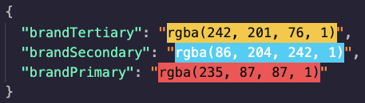

# figma-fetch

Fetch Figma File artboard as JSON then writes to ts and outputs muiTheme. You will need to organize/tweak `index.js` if your artboard looks different than the example shown below.

### Install

```
npm install
```

### Create `.env`

Add Figma API Key (Account settings > Personal access tokens) and Figma ID (`https://www.figma.com/file/<FIGMA_ID>/`) to `.env` file.

```
API_KEY=********
FIGMA_ID=*******
```

### Run

```
npm run start
```

#### Input Figma File


#### Output JSON

Default outputs `dist/theme.ts` to `./dist` directory. Palette is formatted to `{name: color}`.

#### Palette

