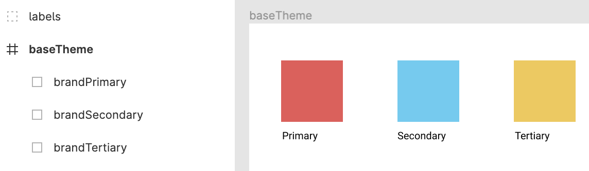

# figma-fetch

Fetch Figma File artboard as JSON. You will need to organize/tweak `index.js` if your artboard looks different than the example shown below.

### Install

```
npm install
```

### Create `.env`

Add Figma API Key (Account settings > Personal access tokens) and Figma ID (`https://www.figma.com/file/<FIGMA_ID>/`) to `.env` file.

```
API_KEY=********
FIGMA_ID=*******
```

### Run

```
npm run start
```

Fetches and formats Figma JSON for you to do what you please.

#### Input Figma File



#### Output JSON

Default output is `palette.json` and `artboard.json` to `./dist` directory. Artboard is everything returned. Palette is formatted to `{name: color}`.

#### Palette

